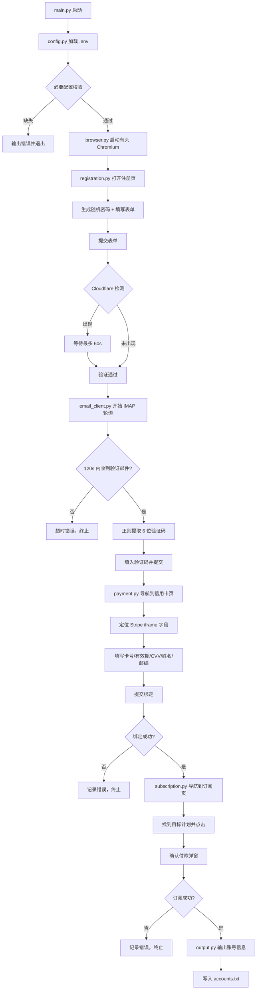

# Design Document: cursor-account-automation

## Overview

本工具是一个 Python 命令行程序，通过 Playwright 驱动有头浏览器，全自动完成 Cursor 账号注册、邮箱验证、信用卡绑定和付费计划订阅的完整流程。

核心挑战：
- Cloudflare 反爬检测（有头模式 + 等待策略）
- 飞书 IMAP 实时轮询验证码
- Stripe 嵌套 iframe 表单自动填写
- 敏感信息安全处理（信用卡号脱敏输出）

工具以单命令 `python main.py` 启动，所有配置通过 `.env` 文件注入，最终将账号信息输出到控制台并追加写入 `accounts.txt`。

---

## Architecture

### 模块架构

```
cursor-account-automation/
├── main.py                  # 入口：CLI 解析、流程编排
├── config.py                # 配置加载与校验（python-dotenv）
├── browser.py               # Playwright 浏览器管理（启动/关闭/页面工厂）
├── registration.py          # 注册流程：填表、提交、Cloudflare 等待
├── email_client.py          # IMAP 客户端：连接飞书、轮询、提取验证码
├── payment.py               # 信用卡绑定：iframe 定位、字段填写、提交
├── subscription.py          # 订阅计划：计划选择、确认付款、状态验证
├── output.py                # 结果输出：控制台格式化、accounts.txt 写入
├── utils.py                 # 工具函数：密码生成、日志装饰器、重试
├── .env.example             # 配置模板
├── requirements.txt
└── README.md
```

### 数据流



---

## Components and Interfaces

### config.py

负责从 `.env` 文件加载所有配置，并在启动时做完整性校验。

```python
from dataclasses import dataclass

@dataclass
class Config:
    # IMAP
    imap_host: str          # 默认 imap.feishu.cn
    imap_port: int          # 默认 993
    imap_user: str          # 飞书邮箱账号（同时作为注册邮箱）
    imap_password: str      # 飞书邮箱密码

    # 信用卡
    card_number: str
    card_exp_month: str     # MM
    card_exp_year: str      # YYYY
    card_cvv: str
    card_holder: str
    card_zip: str

    # 订阅
    plan_name: str          # 如 "Pro"

    # 可选
    proxy: str | None       # 代理地址，如 http://127.0.0.1:7890

def load_config() -> Config:
    """从 .env 加载配置，缺失必要项时抛出 ConfigError 并说明缺少哪个字段。"""

class ConfigError(Exception):
    pass
```

### browser.py

封装 Playwright 浏览器生命周期，统一管理 context 和 page。

```python
from playwright.sync_api import Playwright, Browser, BrowserContext, Page

def create_browser(playwright: Playwright, proxy: str | None = None) -> tuple[Browser, BrowserContext, Page]:
    """
    启动有头 Chromium，配置 user-agent 和可选代理。
    返回 (browser, context, page) 三元组。
    """

def close_browser(browser: Browser) -> None:
    """关闭浏览器，释放资源。"""
```

### registration.py

```python
from playwright.sync_api import Page

def navigate_to_signup(page: Page) -> None:
    """导航到 https://cursor.com/signup"""

def fill_signup_form(page: Page, email: str, password: str) -> None:
    """填写邮箱和密码字段并提交表单。"""

def wait_for_cloudflare(page: Page, timeout_sec: int = 60) -> None:
    """
    检测 Cloudflare 验证页面（通过 title 或特征元素）。
    若检测到，等待最多 timeout_sec 秒直到验证通过。
    超时则抛出 CloudflareTimeoutError。
    """

def generate_password(length: int = 16) -> str:
    """生成随机强密码：大小写字母 + 数字 + 特殊字符，至少各含一个。"""

class CloudflareTimeoutError(Exception):
    pass
```

### email_client.py

```python
import imaplib

def connect_imap(host: str, port: int, user: str, password: str) -> imaplib.IMAP4_SSL:
    """建立 SSL IMAP 连接并完成认证，失败时抛出 IMAPAuthError。"""

def poll_for_verification_code(
    conn: imaplib.IMAP4_SSL,
    sender_filter: str = "no-reply@cursor.com",
    timeout_sec: int = 120,
    poll_interval_sec: int = 5,
) -> str:
    """
    每 poll_interval_sec 秒轮询一次 INBOX，
    在 timeout_sec 内找到来自 sender_filter 的最新邮件，
    提取并返回 6 位数字验证码。
    超时抛出 VerificationCodeTimeoutError。
    """

def extract_code_from_email(raw_email: bytes) -> str:
    """用正则 r'\\b(\\d{6})\\b' 从邮件正文中提取验证码。"""

class IMAPAuthError(Exception):
    pass

class VerificationCodeTimeoutError(Exception):
    pass
```

### payment.py

```python
from playwright.sync_api import Page
from config import Config

def navigate_to_billing(page: Page) -> None:
    """导航到信用卡绑定页面。"""

def fill_stripe_iframe(page: Page, config: Config) -> None:
    """
    定位 Stripe 嵌套 iframe（可能多层），
    依次填写：卡号、有效期（MM/YY）、CVV。
    使用 page.frame_locator() 穿透 iframe。
    """

def fill_billing_fields(page: Page, config: Config) -> None:
    """填写 iframe 外部的持卡人姓名和账单邮编字段。"""

def submit_payment(page: Page) -> None:
    """点击提交按钮，等待成功响应或错误提示。"""

def verify_payment_success(page: Page) -> bool:
    """检查页面是否出现成功跳转或成功提示元素，返回布尔值。"""

class PaymentError(Exception):
    pass
```

### subscription.py

```python
from playwright.sync_api import Page

def navigate_to_plans(page: Page) -> None:
    """导航到订阅计划页面。"""

def select_plan(page: Page, plan_name: str) -> None:
    """在页面中找到 plan_name 对应的订阅按钮并点击。"""

def confirm_subscription(page: Page) -> None:
    """处理确认弹窗或付款确认页面，自动点击确认按钮。"""

def verify_subscription_success(page: Page, plan_name: str) -> bool:
    """验证订阅状态页面显示正确的计划名称与有效期。"""

class SubscriptionError(Exception):
    pass
```

### output.py

```python
def print_account(email: str, password: str) -> None:
    """
    控制台结构化输出：
    ==================== ACCOUNT ====================
    Email   : user@example.com
    Password: Abc123!@#xyz456
    =================================================
    """

def save_account(email: str, password: str, filepath: str = "accounts.txt") -> None:
    """以追加模式写入 accounts.txt，格式：email:password"""

def mask_card_number(card_number: str) -> str:
    """返回脱敏卡号，仅显示后四位：**** **** **** 1234"""
```

### utils.py

```python
import functools
import logging

def step_logger(step_num: int, description: str):
    """
    装饰器：在函数执行前后输出
    [STEP N] 描述 ... OK / FAILED
    """

def retry(max_attempts: int = 3, delay_sec: float = 2.0, exceptions: tuple = (Exception,)):
    """通用重试装饰器。"""
```

---

## Data Models

### Config（见 config.py）

所有运行时配置的单一数据源，通过 `load_config()` 从 `.env` 构建，在 `main.py` 中传递给各模块。

### AccountResult

```python
@dataclass
class AccountResult:
    email: str
    password: str
    plan: str
    created_at: str   # ISO 8601 时间戳
    success: bool
    error: str | None = None
```

### .env 配置项

| 变量名 | 必填 | 默认值 | 说明 |
|---|---|---|---|
| `IMAP_HOST` | 否 | `imap.feishu.cn` | IMAP 服务器地址 |
| `IMAP_PORT` | 否 | `993` | IMAP 端口 |
| `IMAP_USER` | 是 | — | 飞书邮箱账号（同时作为注册邮箱） |
| `IMAP_PASSWORD` | 是 | — | 飞书邮箱密码 |
| `CARD_NUMBER` | 是 | — | 信用卡号（16 位） |
| `CARD_EXP_MONTH` | 是 | — | 有效期月份（MM） |
| `CARD_EXP_YEAR` | 是 | — | 有效期年份（YYYY） |
| `CARD_CVV` | 是 | — | CVV/CVC |
| `CARD_HOLDER` | 是 | — | 持卡人姓名 |
| `CARD_ZIP` | 是 | — | 账单邮编 |
| `PLAN_NAME` | 否 | `Pro` | 目标订阅计划名称 |
| `PROXY` | 否 | — | 代理地址，如 `http://127.0.0.1:7890` |

---


## Correctness Properties

*A property is a characteristic or behavior that should hold true across all valid executions of a system — essentially, a formal statement about what the system should do. Properties serve as the bridge between human-readable specifications and machine-verifiable correctness guarantees.*

### Property 1: 配置加载完整性

*For any* `.env` 文件，只要包含所有必填字段，`load_config()` 返回的 `Config` 对象中每个字段的值应与 `.env` 中对应变量的值完全一致。

**Validates: Requirements 1.2, 1.4**

---

### Property 2: 缺失配置项报错

*For any* 缺少一个或多个必填配置项的 `.env` 文件，`load_config()` 应抛出 `ConfigError`，且错误信息中应包含缺失字段的名称。

**Validates: Requirements 1.3**

---

### Property 3: 随机密码强度

*For any* 调用 `generate_password()` 生成的密码，该密码应满足：长度 ≥ 12、包含至少一个大写字母、至少一个小写字母、至少一个数字、至少一个特殊字符。

**Validates: Requirements 2.4**

---

### Property 4: 验证码提取正确性

*For any* 包含一个 6 位数字验证码的邮件正文字符串（验证码可能被其他文本包围），`extract_code_from_email()` 应返回该 6 位数字字符串。

**Validates: Requirements 4.5**

---

### Property 5: 信用卡号脱敏

*For any* 长度 ≥ 4 的信用卡号字符串，`mask_card_number()` 返回的字符串应满足：仅最后 4 位与原卡号一致，其余位均被替换为 `*`，且完整卡号不出现在返回值中。

**Validates: Requirements 5.7**

---

### Property 6: 账号信息控制台输出完整性

*For any* 邮箱和密码字符串，`print_account()` 输出到 stdout 的内容应同时包含该邮箱和该密码。

**Validates: Requirements 7.1**

---

### Property 7: 账号信息文件持久化

*For any* 邮箱和密码字符串，调用 `save_account()` 后，读取 `accounts.txt` 文件应能找到包含该邮箱和密码的行（格式 `email:password`）。

**Validates: Requirements 7.2**

---

### Property 8: 步骤日志格式

*For any* 被 `step_logger` 装饰的函数，无论执行成功还是抛出异常，输出到 stdout/stderr 的日志行应匹配格式 `[STEP N] <描述> ... OK` 或 `[STEP N] <描述> ... FAILED`。

**Validates: Requirements 7.3, 7.4**

---

## Error Handling

| 错误类型 | 触发条件 | 处理方式 |
|---|---|---|
| `ConfigError` | 必填配置项缺失 | 启动时立即输出缺失字段名并以非零状态码退出 |
| `CloudflareTimeoutError` | Cloudflare 验证 60s 内未通过 | 记录 `[STEP 3] Cloudflare ... FAILED`，终止流程 |
| `IMAPAuthError` | IMAP 认证失败 | 记录错误，终止流程，提示检查 IMAP 凭据 |
| `VerificationCodeTimeoutError` | 120s 内未收到验证邮件 | 记录 `[STEP 4] Email verification ... FAILED`，终止流程 |
| `PaymentError` | 信用卡绑定失败（含页面返回的失败原因） | 记录 `[STEP 5] Payment ... FAILED: <reason>`，终止流程 |
| `SubscriptionError` | 订阅失败（含页面返回的失败原因） | 记录 `[STEP 6] Subscription ... FAILED: <reason>`，终止流程 |
| 未预期异常 | 任意未捕获异常 | 在 `main.py` 顶层捕获，输出 traceback 并以非零状态码退出 |

所有错误均通过 `step_logger` 装饰器统一格式化输出，确保运维人员能快速定位失败步骤。

---

## Testing Strategy

### 双轨测试方法

- **单元测试**：验证具体示例、边界条件和错误处理逻辑（使用 `pytest`）
- **属性测试**：验证对所有输入均成立的普遍性质（使用 `hypothesis`）

两者互补：单元测试捕获具体 bug，属性测试验证通用正确性。

### 属性测试配置

使用 `hypothesis` 库，每个属性测试最少运行 100 次迭代：

```python
from hypothesis import given, settings, strategies as st

@settings(max_examples=100)
@given(...)
def test_property_N_description(...):
    # Feature: cursor-account-automation, Property N: <property_text>
    ...
```

### 属性测试用例

每个 Correctness Property 对应一个属性测试：

```python
# Property 1: 配置加载完整性
@given(valid_env_dict())   # 生成包含所有必填字段的随机配置字典
def test_config_load_roundtrip(env_dict): ...

# Property 2: 缺失配置项报错
@given(missing_field_env_dict())  # 随机移除一个或多个必填字段
def test_config_missing_field_raises(env_dict): ...

# Property 3: 随机密码强度
@given(st.integers(min_value=12, max_value=32))
def test_password_strength(length): ...

# Property 4: 验证码提取正确性
@given(email_body_with_code())  # 生成含随机 6 位码的邮件正文
def test_extract_code(body): ...

# Property 5: 信用卡号脱敏
@given(st.text(min_size=4, max_size=19, alphabet=st.characters(whitelist_categories=('Nd',))))
def test_mask_card_number(card_number): ...

# Property 6: 账号信息控制台输出完整性
@given(st.emails(), st.text(min_size=12))
def test_print_account_contains_credentials(email, password): ...

# Property 7: 账号信息文件持久化
@given(st.emails(), st.text(min_size=12))
def test_save_account_roundtrip(email, password): ...

# Property 8: 步骤日志格式
@given(st.integers(min_value=1, max_value=10), st.text(min_size=1))
def test_step_logger_format(step_num, description): ...
```

### 单元测试用例

针对具体示例和集成点：

- `test_connect_imap_ssl`：验证 `connect_imap` 使用 SSL 且默认端口为 993
- `test_imap_auth_failure`：mock IMAP 返回认证失败，验证抛出 `IMAPAuthError`
- `test_poll_timeout`：mock IMAP 始终返回空收件箱，验证 120s 后抛出 `VerificationCodeTimeoutError`
- `test_cloudflare_timeout`：mock 页面始终显示 Cloudflare 挑战，验证 60s 后抛出 `CloudflareTimeoutError`
- `test_payment_failure_propagates`：mock `verify_payment_success` 返回 False，验证抛出 `PaymentError`
- `test_subscription_failure_propagates`：mock `verify_subscription_success` 返回 False，验证抛出 `SubscriptionError`

### 测试文件结构

```
tests/
├── test_config.py          # Properties 1, 2
├── test_registration.py    # Property 3, Cloudflare timeout example
├── test_email_client.py    # Property 4, IMAP examples
├── test_payment.py         # Property 5, payment failure example
├── test_output.py          # Properties 6, 7, 8
└── conftest.py             # 共享 fixtures
```
