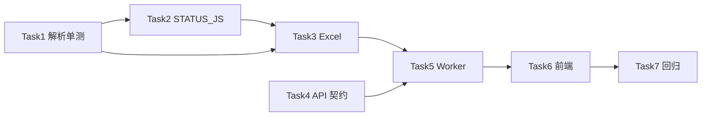

# 账单列表净支出汇总 — Implementation Plan

> **For agentic workers:** REQUIRED: Use superpowers:subagent-driven-development (if subagents available) or superpowers:executing-plans to implement this plan. Steps use checkbox (`- [ ]`) syntax for tracking.

**Goal:** 新增独立功能：按「账单月份」抓取 Billing **Invoices** 五列表格，Paid 用 Amount 列、Refunded 用 Status 括号内金额，计算账期真实总支出并导出 Excel；与现有 PDF 下载**并存、互不替代**。

**Architecture:** 扩展 `_BILLING_LIST_JS` 抓取 Date/Description/Status/Amount/Invoice；`billing_ledger.py` 实现分源金额与汇总；`with_billing_ledger` 任务仅做列表解析 + Excel（本任务不进 Stripe 下 PDF）；前端独立按钮 + 复用 SSE/下载。

**Tech Stack:** Python 3.10+、FastAPI、Playwright (patchright)、openpyxl、Alpine.js、现有 SSE 任务框架。

**设计文档：** [2026-05-19-billing-ledger-export-design.md](./2026-05-19-billing-ledger-export-design.md)

---

## 文件清单（预计）

| 操作 | 路径 |
|------|------|
| Create | `cam/billing_ledger.py` |
| Create | `tests/test_billing_ledger.py` |
| Modify | `cam/exporter.py`（`_STATUS_JS`、可选 `fetch_billing_list_rows`） |
| Modify | `cam/web_server.py`（`RunRequest`、`/_run_worker` 分支） |
| Modify | `cam/static/index.html`（按钮、JS、`phase` 文案） |
| Modify | `tests/test_invoice_paid_filter.py`（如有必要，补充夹具） |

---

## Phase 1：解析与汇总核心（可单测）

### Task 1: 账单行金额解析单元测试

**Files:**
- Create: `tests/test_billing_ledger.py`
- Create: `cam/billing_ledger.py`（骨架 + 解析函数）

- [ ] **Step 1: 写失败测试**

```python
# tests/test_billing_ledger.py
from decimal import Decimal
from cam.billing_ledger import (
    parse_amount_usd,
    parse_status_and_amount,
    summarize_ledger_rows,
)

def test_parse_refunded_with_amount_in_status():
    status, refund_amt = parse_refund_amount_from_status("Refunded (12.07 USD)")
    assert status == "refunded"
    assert refund_amt == Decimal("12.07")

def test_net_spend_april_2026_screenshot_sample():
    """63.96 + 21.32 - 12.07 = 73.21"""
    rows = [
        {"status": "paid", "list_amount_usd": Decimal("63.96"), "refund_in_status_usd": None, "billing_month": "2026-04"},
        {"status": "refunded", "list_amount_usd": Decimal("21.32"), "refund_in_status_usd": Decimal("12.07"), "billing_month": "2026-04"},
    ]
    s = summarize_ledger_rows(rows, billing_month="2026-04")
    assert s.amount_total_usd == Decimal("85.28")   # 63.96 + 21.32
    assert s.refund_total_usd == Decimal("12.07")
    assert s.net_spend_usd == Decimal("73.21")
```

- [ ] **Step 2: 运行确认失败**

```bash
cd cursor-account-manager
PYTHONPATH=. python -m pytest tests/test_billing_ledger.py -v
```

Expected: FAIL（模块/函数不存在）

- [ ] **Step 3: 实现 `billing_ledger.py` 解析与汇总**

要点：
- `parse_status_and_amount(raw: str) -> tuple[str, Decimal|None, str]`
- `build_billing_list_row(raw_dict, selected_month) -> BillingListRow | None`
- `summarize_ledger_rows(rows, billing_month) -> BillingLedgerSummary`
- open 状态行不计入净支出；`amount_usd is None` 记入 warnings

- [ ] **Step 4: 运行确认通过**

```bash
PYTHONPATH=. python -m pytest tests/test_billing_ledger.py -v
```

---

### Task 2: 扩展 `_STATUS_JS` 抓取金额

**Files:**
- Modify: `cam/exporter.py`（`_STATUS_JS` 常量，约 L836）
- Modify: `tests/test_invoice_paid_filter.py` 或 `tests/test_billing_ledger.py`

- [ ] **Step 1: 新增 `_BILLING_LIST_JS`**：五列 `date, description, status, amountText, url`（见设计文档附录 A）

- [ ] **Step 2: 新增 `fetch_billing_list_rows(cookie_val, month) -> list[dict]`**

封装现有 `_fetch_billing_items_in_ctx` 逻辑，返回：

```python
[
  {"url": "...", "status": "paid", "date": "...", "amountText": "$20.00"},
  ...
]
```

- [ ] **Step 3: 在 `billing_ledger.py` 增加 `rows_from_billing_page_items(items, selected_month)`**

将 exporter 返回的 tuple 转为 `BillingListRow` 列表（调用 `_normalize_status_text`、`_billing_month_key`）。

- [ ] **Step 4: 补充测试：mock items 列表 → 汇总结果正确**

---

## Phase 2：Excel 导出

### Task 3: 账期净支出工作簿

**Files:**
- Modify: `cam/billing_ledger.py`

- [ ] **Step 1: 实现 `export_billing_ledger_workbook(path, summaries, detail_rows)`**

- Sheet `账期净支出汇总`：列见设计文档 §4.1
- Sheet `账单原始明细`：列见设计文档 §4.1
- 使用 openpyxl（与 `export_token_summary_xlsx` 风格一致：表头加粗、冻结首行）

- [ ] **Step 2: 单测：写入临时文件，openpyxl 读回行数**

```bash
PYTHONPATH=. python -m pytest tests/test_billing_ledger.py -v -k workbook
```

---

## Phase 3：后端任务分支

### Task 4: 扩展 `RunRequest` 与校验

**Files:**
- Modify: `cam/web_server.py`（`RunRequest`、worker 入口）

- [ ] **Step 1: `RunRequest` 增加 `with_billing_ledger: bool = False`**

- [ ] **Step 2: 在 `POST /api/run` 入口校验**

当 `with_billing_ledger` 为 True：
- 要求 `month` 匹配 `^\d{4}-\d{2}$`
- 服务端强制 `with_invoices=False`, `with_summary=False`, `with_raw=False`（或返回 400 并提示）

- [ ] **Step 3: `_fetch_targets_for_run` 在 ledger 模式返回空 tuple**

---

### Task 5: Worker 账本模式实现

**Files:**
- Modify: `cam/web_server.py`
- Modify: `cam/billing_ledger.py`（增加 `scrape_ledger_for_account` 异步封装）

- [ ] **Step 1: 提取函数 `_run_billing_ledger_job(task_id, req, accounts)`**

流程：
1. 对每个账号：`progress fetching` → `get_valid_token` → `progress ledger`
2. `asyncio.to_thread` 或复用 exporter 内 playwright 模式调用 `fetch_billing_list_rows`
3. `summarize_ledger_rows` + 收集明细行
4. `progress done` / `error`
5. 全局 `summary` → `export_billing_ledger_workbook(out_dir / f"账期净支出_{month}.xlsx")`
6. `ready` + `download_token`

- [ ] **Step 2: 在 `_worker()` 开头分支**

```python
if req.with_billing_ledger:
    _run_billing_ledger_job(...)
    return
```

- [ ] **Step 3: 并发**

复用 invoice 并发模型：单 browser + Semaphore + 每账号 context，**仅抓 Billing 列表，不调用 Stripe PDF 下载**（与「开始拉取」PDF 功能代码路径分离）。

可抽 `exporter.scrape_billing_ledger_batch(accounts, month, progress_cb)` 放在 `billing_ledger.py` 或 `exporter.py`。

- [ ] **Step 4: 手工冒烟**

```bash
# 启动服务后，POST 1 个测试账号 + with_billing_ledger=true
curl -X POST http://127.0.0.1:8765/api/run -H 'Content-Type: application/json' -d '{...}'
```

---

## Phase 4：前端

### Task 6: 账号库按钮与校验

**Files:**
- Modify: `cam/static/index.html`（sticky bar ~L2637、Alpine methods ~L4427）

- [ ] **Step 1: sticky bar 在「开始拉取」前增加按钮**

```html
<button class="btn btn-primary btn-sm" @click="startBillingLedgerExport()" :disabled="selectedEmails.size===0">
  导出账期净支出 (<span x-text="selectedEmails.size"></span>)
</button>
```

- [ ] **Step 2: 实现 `startBillingLedgerExport()`**

- 校验 `selectedMonth`（无则 `alert('请先选择账单月份')` 并 return）
- 重置 `runItems`、`view='run'`
- POST body 见设计文档 §6.3

- [ ] **Step 3: 更新 `runStatusText` / `phaseLabel` / `onSSEProgress`**

识别 `phase === 'ledger'` → 「解析账单列表…」

- [ ] **Step 4: 下载按钮**

`ready` 后 `download_token` 文案改为「下载账期净支出 Excel」；`downloadZipLabel` 在 ledger 模式可隐藏 ZIP 或仅显示 Excel 下载。

可选：任务级 flag `runMode: 'ledger' | 'default'` 存 sessionStorage，区分下载 UI。

---

## Phase 5：文档与回归

### Task 7: 文档与回归清单

**Files:**
- Modify: `cursor-account-manager/README.md`（简短说明新按钮）
- 可选：`.env.example` 无需新变量

- [ ] **Step 1: README 增加「账期净支出导出」小节**

- [ ] **Step 2: 全量相关测试**

```bash
PYTHONPATH=. python -m pytest tests/test_billing_ledger.py tests/test_invoice_paid_filter.py -v
```

- [ ] **Step 3: 手工回归清单**

| # | 步骤 | 期望 |
|---|------|------|
| 1 | 不选月份点「导出账期净支出」 | 提示选月份 |
| 2 | 选月份 + 2 账号导出 | Excel 两行汇总 + 明细 |
| 3 | 含 Refunded (12.07 USD) + Amount 21.32 | 净支出 = 63.96+21.32-12.07=73.21 |
| 4 | 另开「开始拉取」+ PDF | 两功能互不影响；ledger 任务目录无 pdf |

---

## 依赖关系图



---

## 预估工时（供排期）

| Phase | 预估 |
|-------|------|
| Phase 1 | 0.5–1 d |
| Phase 2 | 0.5 d |
| Phase 3 | 1 d |
| Phase 4 | 0.5 d |
| Phase 5 | 0.5 d |
| **合计** | **3–3.5 d** |

---

## 提交建议（实施时）

1. `feat(billing-ledger): parse amount from billing list rows`
2. `feat(billing-ledger): export summary and detail xlsx`
3. `feat(api): add with_billing_ledger run mode`
4. `feat(ui): billing ledger export button and progress phases`

---

## 验收标准（Definition of Done）

- [ ] 选中账号 + 账单月份 → 点击「导出账期净支出」→ 进入进度页 → 完成后可下载 Excel
- [ ] Excel 含「账期净支出汇总」「账单原始明细」两个 Sheet
- [ ] 净支出 = 支付合计 − 退款合计，与 Stripe 列表手算一致（抽样 3 账号）
- [ ] 本任务目录 **不生成** `invoices/*.pdf`（PDF 仍走原「开始拉取」）
- [ ] 单元测试 `test_billing_ledger.py` 全部通过（含 63.96+21.32−12.07=73.21 样例）
- [ ] 原「开始拉取」+ PDF / Token 流程无回归
