# Cursor Account Manager — 技术说明与学习定位

> 本文档面向需要**理解、维护、二次开发**本项目的工程师。  
> 项目路径：`cursor-account-manager/`（与 `cursor-account-automation/` 注册流水线解耦）。

---

## 1. 学习定位：先看什么、后看什么

| 阶段 | 目标 | 建议阅读顺序 |
|------|------|----------------|
| **入门** | 能本地跑起来 Web UI / CLI | [README.md](../README.md) → `.env.example` → `python -m cam web` |
| **架构** | 理解模块边界与数据流 | 本文 §2–§4 → [DESIGN.md](../DESIGN.md) |
| **前端** | 改页面、任务进度、交互 | `cam/static/index.html`（Alpine 单页） |
| **拉取/导出** | 发票、Excel、账期净支出 | `cam/web_server.py` → `cam/exporter.py` → `cam/billing_ledger.py` |
| **登录/Token** | 浏览器登录、API 鉴权 | `cam/token_manager.py` → `cam/browser_login.py` → `cam/api_client.py` |
| **BI 同步** | StarRocks 日同步、双写 | `cam/bi_sync.py` → `cam/starrocks_loader.py` → [starrocks-daily-sync-tech-design.md](./starrocks-daily-sync-tech-design.md) |
| **定时任务** | 凌晨同步、消费刷新 | `cam/scheduler.py` |

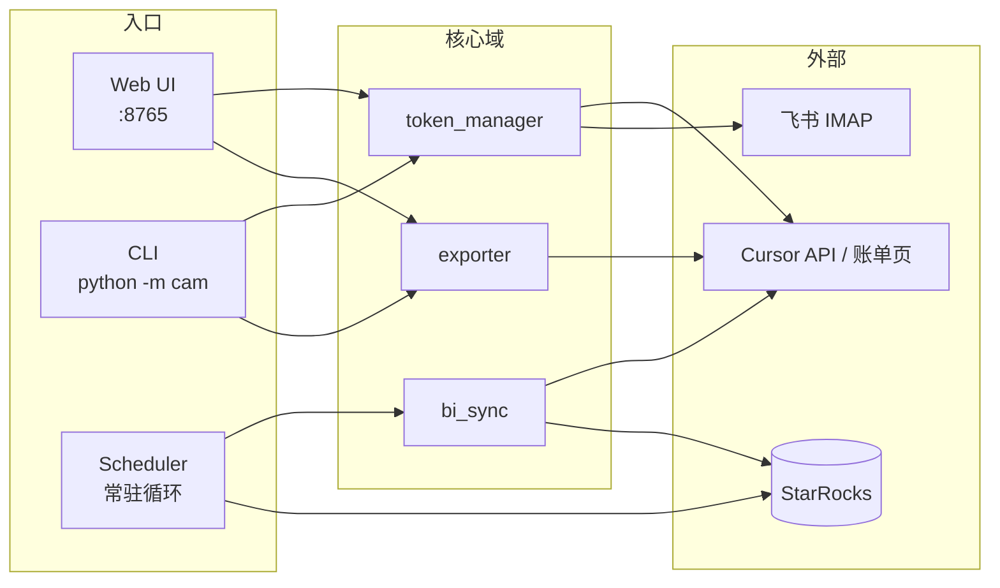

---

## 2. 技术栈总览

### 2.1 语言与运行时

| 类别 | 选型 | 说明 |
|------|------|------|
| **主语言** | Python 3.10+ | 全后端逻辑、浏览器自动化、导出、同步 |
| **前端标记** | HTML + CSS + 内联 JS | 无构建链，单文件 `index.html` |
| **数据库协议** | MySQL 协议 | 连接 StarRocks（9030 端口） |
| **本地存储** | SQLite | `tokens.db` 存 OAuth Token |

### 2.2 后端框架与核心库

| 组件 | 库 / 框架 | 用途 |
|------|-----------|------|
| **Web 服务** | [FastAPI](https://fastapi.tiangolo.com/) + [Uvicorn](https://www.uvicorn.org/) | REST API、SSE 进度流、文件下载 |
| **CLI** | [Click](https://click.palletsprojects.com/) | `login` / `fetch` / `dump` / `sync-daily` 等命令 |
| **浏览器自动化** | [patchright](https://github.com/Kaliiiiiiiiii-Vinyzu/patchright) | Playwright 反检测分支，过 Cloudflare Turnstile |
| **HTTP 客户端** | `requests` | Cursor API、验证码求解服务 |
| **配置** | `python-dotenv` | `.env` 加载到 `cam/config.py` |
| **Excel** | `openpyxl` | 汇总表、账期净支出、模板下载 |
| **PDF** | `pymupdf` + `Pillow` | 发票 PDF 处理（按需） |
| **StarRocks** | `pymysql` + `DBUtils` | 连接池、ODS 表写入 |
| **验证码兜底** | `capsolver` / `2captcha-python` | Turnstile 外部求解（可选） |

### 2.3 前端技术（无 SPA 框架）

| 技术 | 说明 |
|------|------|
| **Alpine.js 3** | 通过 CDN 引入，页面状态机（`view`: list / upload / run / sync） |
| **Tailwind CSS** | CDN 工具类 + 大量自定义 CSS 变量（`--primary` 等） |
| **原生 Fetch + EventSource** | 调用 `/api/*`，SSE 订阅 `/api/stream/{task_id}` |
| **字体** | Google Fonts：Fira Sans / Fira Code |
| **图标** | 内联 SVG；站点图标 `static/favicon.svg` |

> **注意**：前端没有 Webpack/Vite/React，所有逻辑在 `cam/static/index.html` 的 `<script>function app() { ... }` 中。

### 2.4 插件 / 浏览器扩展

| 名称 | 路径 | 作用 |
|------|------|------|
| **turnstilePatch** | 本仓库未内置；注册项目在 `cursor-account-automation/turnstilePatch/` | 修改 `MouseEvent.screenX/Y`，降低 CDP 指纹检测（账单页主要依赖 patchright） |

账单列表、发票下载、账期净支出解析均在 **patchright Chromium** 中完成，不依赖 Chrome 扩展。

### 2.5 部署与运维脚本

| 脚本 | 平台 | 作用 |
|------|------|------|
| `deploy-to-windows.sh` | macOS → Windows SSH | 打包上传 + `windows-setup.ps1` |
| `windows-setup.ps1` | Windows | venv、依赖、`.env`、启动服务 |
| `restart.sh` / `logs.sh` | 运维 | 重启、跟日志 |
| `deploy.sh` | 通用 | 本地部署辅助 |

---

## 3. 系统架构与业务全景

### 3.1 逻辑分层

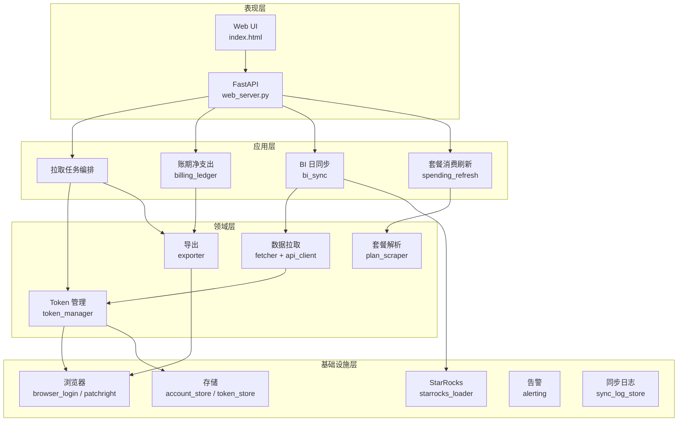

### 3.2 核心业务闭环

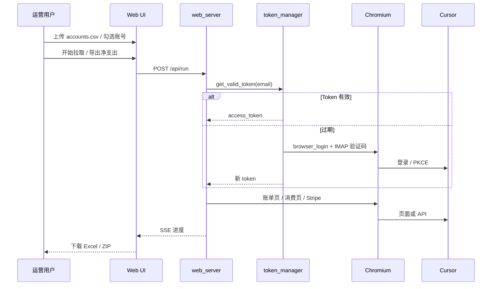

### 3.3 与注册项目的关系

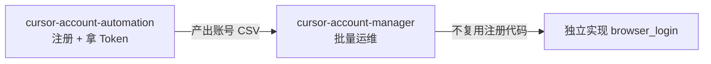

---

## 4. 目录与模块职责（代码地图）

```
cursor-account-manager/
├── cam/                          # 应用主包
│   ├── web_server.py             # FastAPI 路由、任务队列、SSE
│   ├── static/index.html         # 前端单页
│   ├── cli.py                    # 命令行入口
│   ├── config.py                 # Settings（.env）
│   ├── models.py                 # Account / Snapshot 等 dataclass
│   ├── account_store.py          # accounts.csv 读写
│   ├── token_store.py            # tokens.db
│   ├── token_manager.py          # Token 缓存 / 刷新 / 浏览器兜底
│   ├── browser_login.py          # Playwright 登录 + PKCE
│   ├── email_client.py           # IMAP 收验证码
│   ├── turnstile_solver.py       # 外部验证码 API
│   ├── api_client.py             # Cursor 内部 API 封装
│   ├── fetcher.py                # 批量拉 usage / events
│   ├── exporter.py               # Excel / PDF / 账单页 DOM 抓取
│   ├── billing_ledger.py         # 账期净支出计算 + Excel
│   ├── plan_scraper.py           # 消费页套餐/按量解析
│   ├── spending_refresh.py       # 定时刷新套餐字段
│   ├── bi_sync.py                # BI 日同步编排
│   ├── starrocks_loader.py       # StarRocks ODS 写入（含双写）
│   ├── sync_log_store.py         # 同步任务 SQLite 日志
│   ├── scheduler.py              # cron 风格调度
│   └── alerting.py               # 飞书等告警
├── data/                         # 运行时数据（gitignore 部分）
├── tests/                        # 单元测试
└── docs/                         # 设计 / 说明文档
```

---

## 5. 按业务功能拆分讲解

### 5.1 账号库与 Token 管理

**业务目标**：维护一批 Cursor 账号（邮箱 + IMAP 密码 + 飞书归属邮箱），并为每个账号拿到可用的 `access_token` / `refresh_token`。

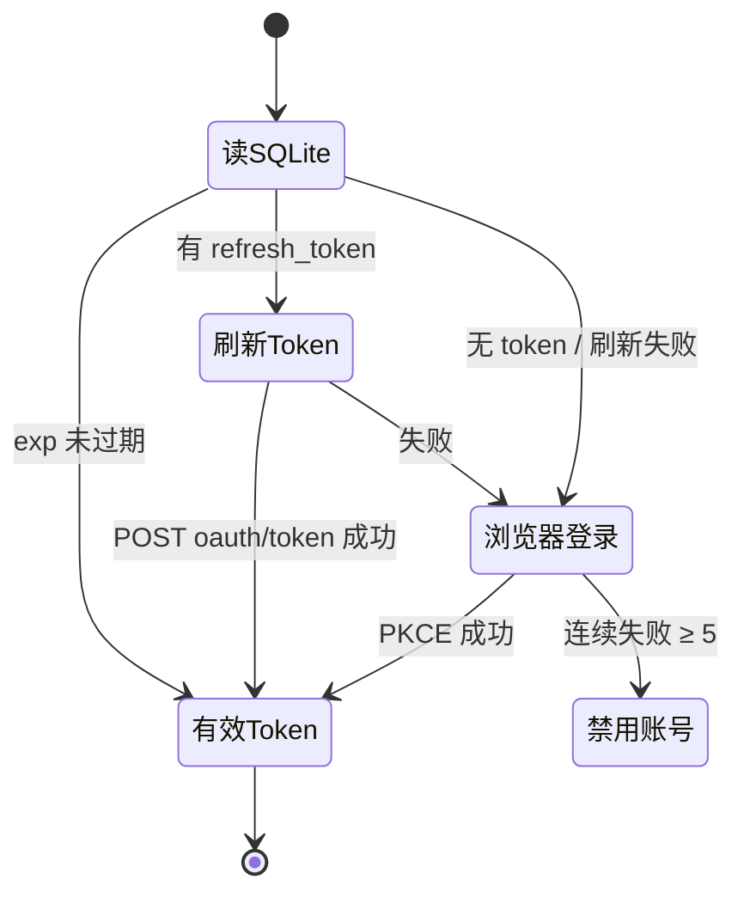

| 模块 | 职责 |
|------|------|
| `account_store.py` | 读 `data/accounts.csv`，Web 保存时写回 |
| `token_store.py` | SQLite `tokens` 表 CRUD、`audit_log` |
| `token_manager.py` | `get_valid_token()` 统一入口，per-email 锁防并发刷新 |
| `browser_login.py` | 打开 `cursor.com/login` → 邮箱验证码 → `loginDeepControl` PKCE |
| `email_client.py` | 轮询 `no-reply@cursor.com` 六位数验证码 |

**关键配置**：`BROWSER_LOGIN_CONCURRENCY`、`PROXY`、`VERIFICATION_CODE_TIMEOUT`。

---

### 5.2 Web UI — 账号库页面

**业务目标**：列表展示账号、搜索、批量勾选、跳转上传/账单调度、触发拉取与净支出导出。

| 能力 | 实现要点 |
|------|----------|
| 账号列表 | `GET /api/accounts`，前端 `dbAccounts` |
| 上传解析 | `POST /api/upload`，解析 CSV/XLSX |
| 保存账号 | `POST /api/accounts/save` |
| 删除账号 | `DELETE /api/accounts/{email}` |
| 套餐/消费刷新 | `POST /api/accounts/refresh-spending` + `plan_scraper` 批量解析 |
| 模板下载 | `GET /api/accounts/template.xlsx` |

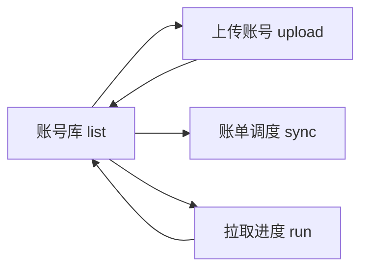

前端路由：`view` 字段 + 面包屑 `breadcrumbLabel()`；主视图切换使用 Alpine `x-show` + 仅入场动画。

---

### 5.3 Web UI — 批量拉取任务（发票 / 汇总 Excel）

**业务目标**：对用户选中账号，在指定账单月份内拉取 API 数据、可选下载 Stripe 发票 PDF、生成汇总 Excel/ZIP。

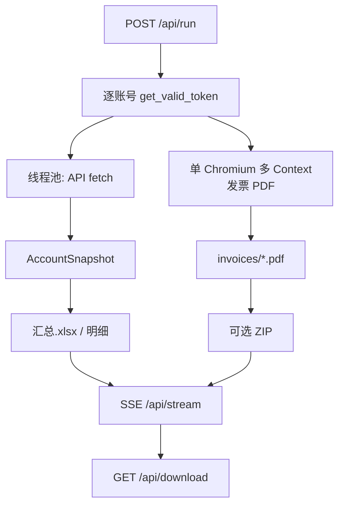

| 模块 | 职责 |
|------|------|
| `web_server.py` | `_run_job`、任务状态 `_tasks`、`progress_cb` |
| `fetcher.py` | 并发拉 usage / plan / events / stripe |
| `exporter.py` | `_download_account_all_pdfs`、汇总 Excel 多 Sheet |
| `api_client.py` | `CursorClient` 封装 Dashboard / Stripe API |

**并发控制**：

- API：`API_CONCURRENCY`、`WEB_FETCH_MAX_WORKERS`
- 浏览器：`INVOICE_DOWNLOAD_CONCURRENCY`、`INVOICE_ACTIVE_CONTEXT_LIMIT`（单 Browser 多 Context）

---

### 5.4 账期净支出导出（Billing Ledger）

**业务目标**：不下载 PDF，仅解析 Cursor Billing Invoices 列表，按账期计算：

\[
\text{净支出} = \sum \text{Amount(Paid+Refunded)} - \sum \text{Status 内退款额}
\]

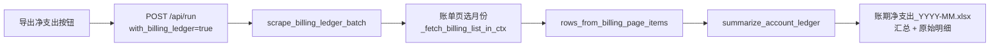

| 模块 | 职责 |
|------|------|
| `billing_ledger.py` | 批量编排、`export_billing_ledger_workbook` |
| `exporter.py` | `_BILLING_LIST_JS`、月份下拉、空列表/加载中判定 |
| `config.py` | `BILLING_LEDGER_CONCURRENCY`、`BILLING_LEDGER_RETRY_*` |

**重试策略（重要）**：

- **会重试**：页面未就绪、仍在加载、未登录、月份筛选未生效
- **不重试**：筛选已是目标月且该月无账单（含 DOM 残留旧月行）

---

### 5.5 发票 PDF 下载（浏览器）

**业务目标**：在账单页拿到 `invoice.stripe.com` 链接，打开 Stripe Hosted Invoice 页点击下载 PDF。

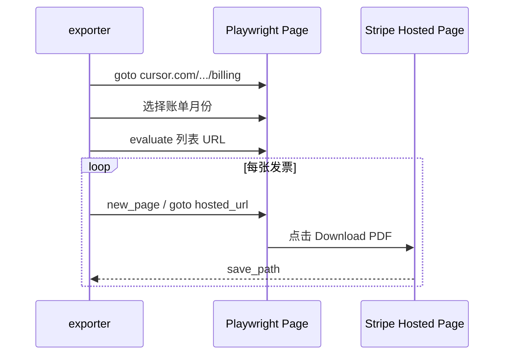

实现集中在 `exporter.py`（`download_all_pdfs`、`_stripe_page_click_pdf`）。  
设计说明见 [invoice-download-single-browser-design.md](./invoice-download-single-browser-design.md)。

---

### 5.6 BI 日同步（StarRocks ODS）

**业务目标**：按北京时间「业务日」，将各账号使用明细（含套餐金额、模型、token、成本等）写入 `ods_cursor_usage_events_di`，供 BI 报表使用。

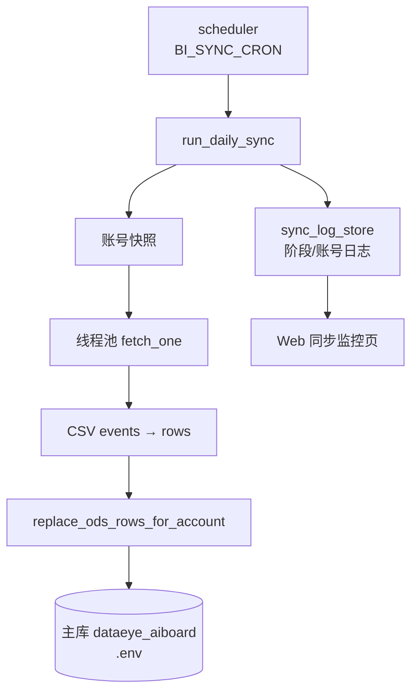

| 模块 | 职责 |
|------|------|
| `bi_sync.py` | 快照、并发 fetch、单 writer 写库、失败补拉 |
| `starrocks_loader.py` | 连接池、分区检查、DELETE+INSERT 覆盖写 |
| `DualStarRocksLoader` | 备用库双写封装；当前默认关闭 |
| `sync_log_store.py` | run / stage / account 级日志 |

**双写开关**（默认关闭）：

```python
# cam/starrocks_loader.py
BI_SYNC_DUAL_WRITE = False
BI_SYNC_BACKUP_JDBC_URL = ""
```

详细表结构与设计：[starrocks-daily-sync-tech-design.md](./starrocks-daily-sync-tech-design.md)。

---

### 5.7 套餐 / 按量付费刷新

**业务目标**：从 Cursor 消费页（`/dashboard/spending`）解析当前套餐名、按量是否开启等，回写账号列表展示字段。

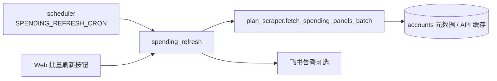

| 模块 | 职责 |
|------|------|
| `plan_scraper.py` | 单 Chromium 批量打开消费页解析 DOM |
| `spending_refresh.py` | 定时任务、并发、锁文件 |
| `web_server.py` | `/api/accounts/refresh-spending` |

---

### 5.8 账单调度监控（Sync UI）

**业务目标**：查看今日 BI 同步是否成功、历史 run、失败账号一键补拉。

| API | 作用 |
|-----|------|
| `GET /api/sync/today` | 今日状态摘要 |
| `GET /api/sync/runs` | 历史 run 列表 |
| `GET /api/sync/run/{run_id}` | 单次详情 |
| `POST /api/sync/run` | 手动触发同步 |
| `POST /api/sync/retry/{run_id}` | 补拉失败账号 |

前端 `view === 'sync'`，与账号库、拉取进度并列。

---

### 5.9 定时调度器

**业务目标**：进程常驻时，按 cron 表达式触发 BI 同步与套餐刷新，文件锁防多实例重入。

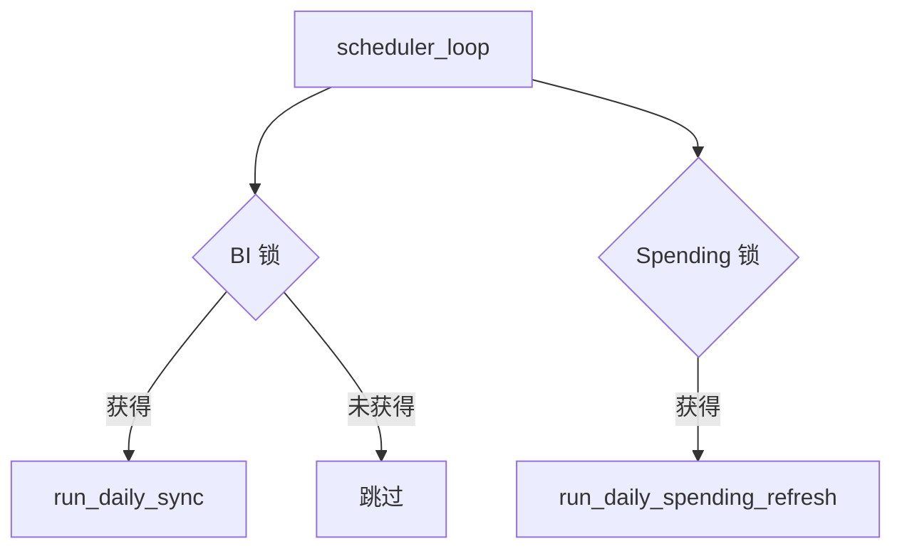

实现：`cam/scheduler.py`（`fcntl` / `msvcrt` 跨平台锁）。

启动方式：`python -m cam web` 内嵌调度线程，或 `sync-scheduler-loop` CLI。

---

## 6. 主要 API 一览（Web）

| 方法 | 路径 | 功能 |
|------|------|------|
| GET | `/` | 前端页面 |
| POST | `/api/upload` | 解析上传文件 |
| POST | `/api/run` | 启动拉取 / 净支出 / 组合任务 |
| GET | `/api/stream/{task_id}` | SSE 任务进度 |
| GET | `/api/download/{token}` | 下载导出文件 |
| GET | `/api/accounts` | 账号列表 |
| POST | `/api/accounts/save` | 保存账号 |
| POST | `/api/accounts/refresh-spending` | 刷新套餐消费 |
| GET/POST | `/api/sync/*` | BI 同步监控与触发 |

---

## 7. 配置项速查

| 变量 | 影响功能 |
|------|----------|
| `PROXY` | 浏览器与 API 代理 |
| `INVOICE_*` / `BILLING_LEDGER_*` | 发票与净支出浏览器并发、重试 |
| `API_CONCURRENCY` | API 拉取与 BI fetch 并发 |
| `BI_SYNC_*` | StarRocks 主库连接 |
| `BI_SYNC_DUAL_WRITE`（代码常量） | 备用库双写开关；当前默认关闭 |
| `SPENDING_REFRESH_*` | 套餐定时刷新 |
| `ALERT_BOT_*` | 飞书告警 |

完整示例见 [.env.example](../.env.example)。

---

## 8. 测试与质量

```bash
cd cursor-account-manager
PYTHONPATH=. .venv/bin/python -m pytest tests/ -q
```

| 测试文件 | 覆盖域 |
|----------|--------|
| `test_billing_ledger.py` | 净支出解析、空账判定 |
| `test_bi_sync_concurrency.py` | BI 并发与单 writer |
| `test_starrocks_dual_write.py` | 双写装载器 |
| `test_performance_tuning.py` | 批量消费页 API |
| `test_invoice_paid_filter.py` | 发票月份过滤 |

---

## 9. 相关文档索引

| 文档 | 内容 |
|------|------|
| [README.md](../README.md) | 安装、使用、命令大全 |
| [DESIGN.md](../DESIGN.md) | 早期 Token / API 设计 |
| [starrocks-daily-sync-tech-design.md](./starrocks-daily-sync-tech-design.md) | BI ODS 表与同步设计 |
| [invoice-download-single-browser-design.md](./invoice-download-single-browser-design.md) | 单 Browser 发票下载 |
| [superpowers/plans/2026-05-19-billing-ledger-export-design.md](./superpowers/plans/2026-05-19-billing-ledger-export-design.md) | 账期净支出产品设计 |

---

## 10. 二次开发常见入口

| 需求 | 建议改动位置 |
|------|----------------|
| 新增 Web 按钮/页面 | `static/index.html` + `web_server.py` 路由 |
| 调整净支出计算公式 | `billing_ledger.py` → `summarize_account_ledger` |
| 账单页抓取不稳定 | `exporter.py` → `_fetch_billing_list_in_ctx` |
| 关闭 StarRocks 双写 | `starrocks_loader.py` → `BI_SYNC_DUAL_WRITE = False` |
| 新增定时任务 | `scheduler.py` + `config.py` |
| 告警渠道 | `alerting.py` |

---

*文档版本：与仓库当前实现同步（含 BI 双写、账期净支出重试策略、Web favicon）。*
